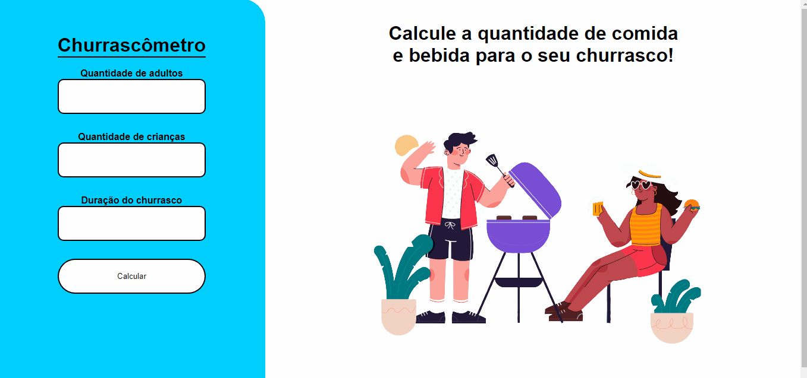

# Barbecue_Calculator
<h2>Sobre</h2>

Projeto feito para calcular a quantidade necessária de items para um churrasco ser feito.

 
 

 <h3>Teste aqui</h3>
 <a href="" target="_blank">Calculadora</a>
 <h2>Tecnologias usadas</h2>
 <ul>
  <li>
Javascript
</li>
  <li>
CSS
</li>
  <li>
HTML
</li>     
</ul>
